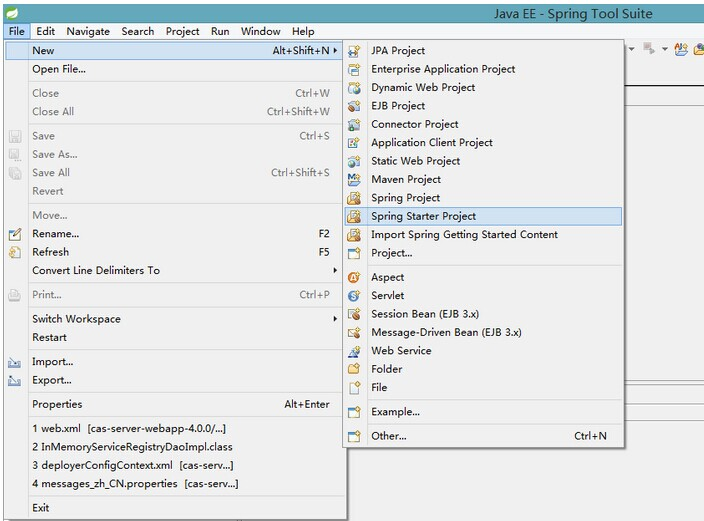
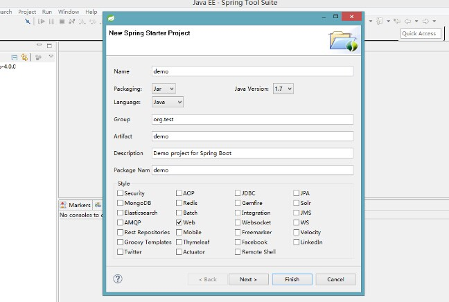
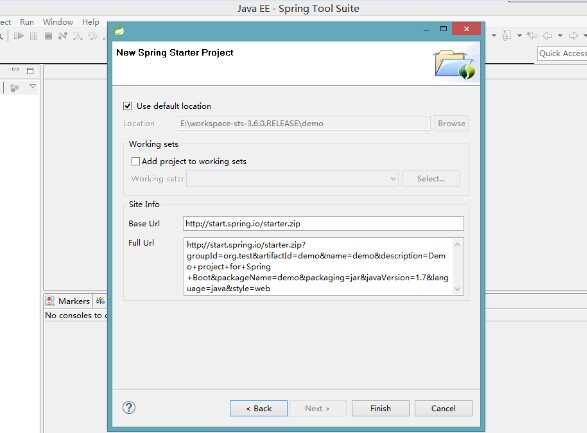
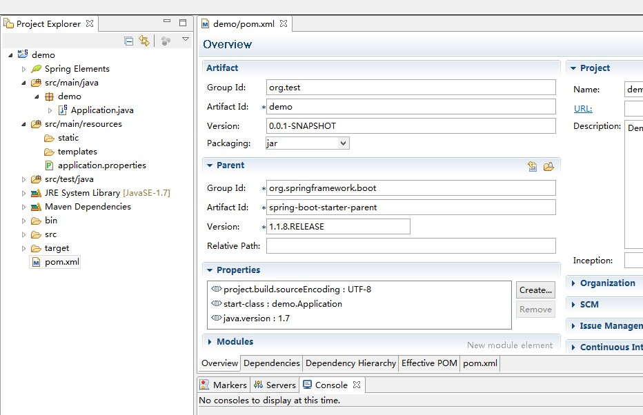
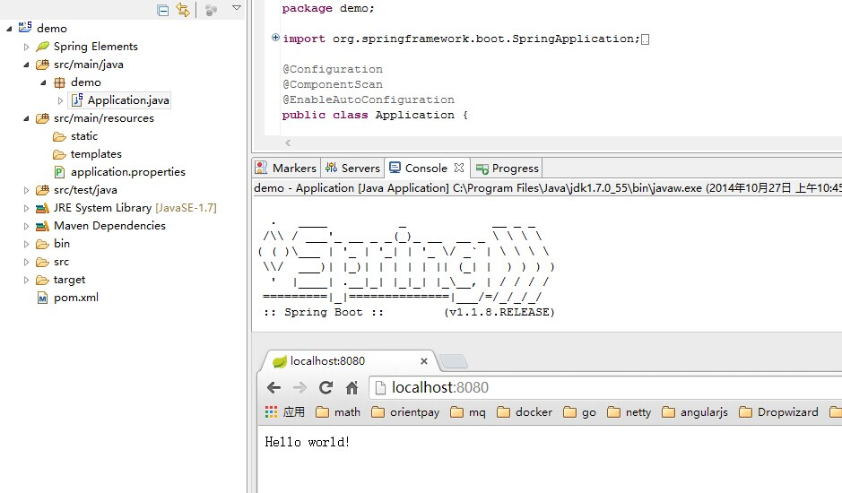

### 开发环境
- Windows 8.1
- JDK 1.7
- maven 3.2.1
- Spring Tool Suite™ 3.6

### 创建maven项目

File-->New-->Spring Starter Project



勾选web-->Next



保持默认-->Finish



最终生成的项目结构如下：



修改Application.java，添加一个Controller
```java
@Configuration
@ComponentScan
@EnableAutoConfiguration
public class Application {

	public static void main(String[] args) {
		SpringApplication.run(Application.class, args);
	}
}

@RestController
class DemoController {
	@RequestMapping("/")
	public String hello() {
		return "Hello world!";
	}
}
```
右键-->Run as -->Java Application



在浏览器中访问[http://localhost:8080/](http://localhost:8080/),即可看到页面成功输出：Hello world!

